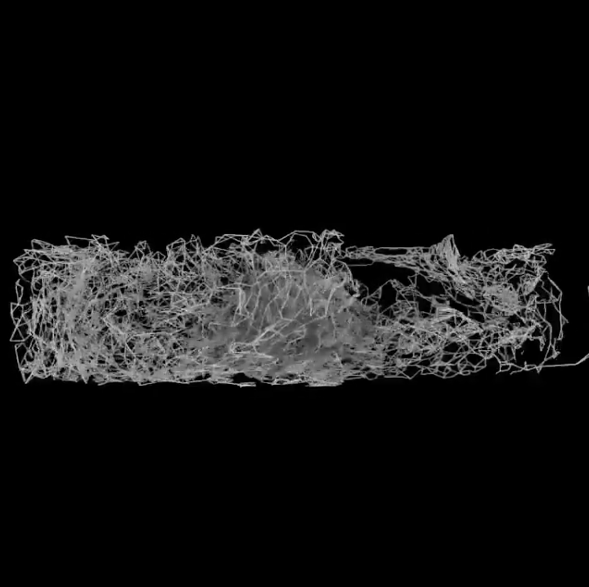

# MEI KONISHI

[Mei Konishi](https://www.instagram.com/p/CCxT384HizV/?igshid=nms9mg4crkxk) is a freelance CG artist based in Tokyo, Japan. Her generative artworks involve a bunch of technique and softwares, such as Cinema 4D to modelling and programming skills to create a complicated artwork. She created textures for certain objects and combined it with processing to generate artworks that moves with music beats.

Here's more works of her [Generative Art Studio](https://generativeartstudio.tokyo).
