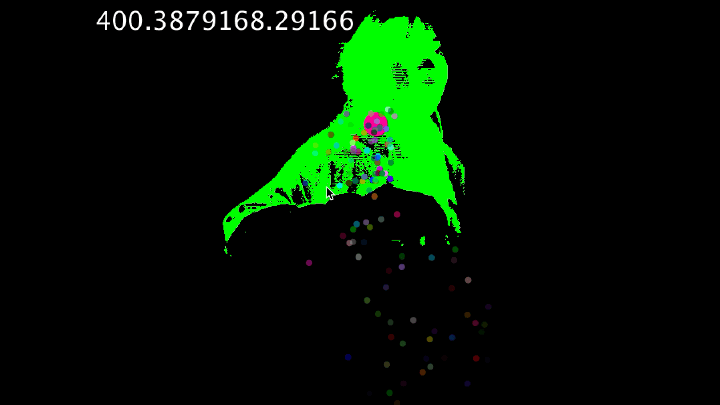
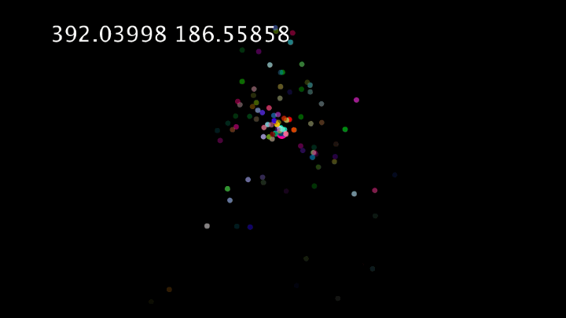
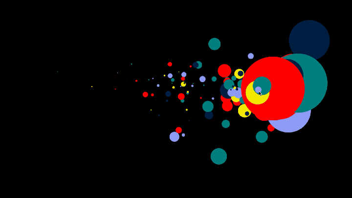

**Work In Progress**

While I was working on collecting data through Kinect Sensor, I have also started to sketch my particle system. Over the week, I have learnt how to use arrayList to store variety number of particles, so that I can add and remove elements from the list. However, when I was trying to combine motion tracking with the particle system, it did not work as I thought. The particle system is still following my position mouse.x and mouse.y even when I have changed it to avgX and avgY(the poison of the pink dot). I think it might be because I have declared the position and avgX and avgY incorrectly. 

I have consulted Karen, she glanced through my code and found that I have to declare all the values before my setup, so that I do not have to declare it again in particles class, and it worked! 

During the week, I have also found a beautiful sketch from open processing, it was code in p5js and created by [André Casey](https://www.openprocessing.org/sketch/446535). The particles are following mouse position and when I stopped, the particles expand and vanished in the end. 

I really love the idea of vanishing particles and wanted to reference it for my graphic output. 

