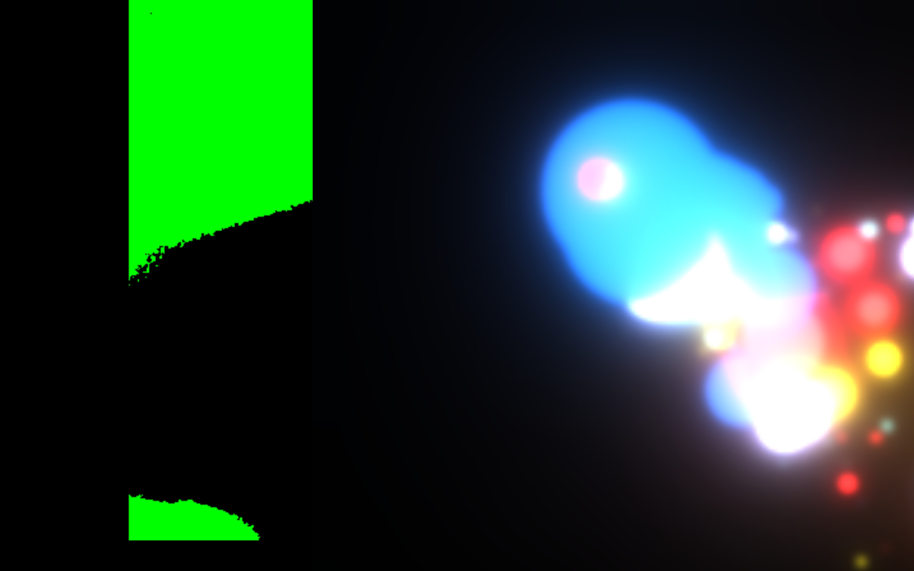

Over the week, I have found a interesting processing library created by Thomas Diewald -- pixelFlow. It is a library for high performance GPU-computing(GLSL), gives developers more direct control of graphics without having to use hardware specific languages. One of its example —bloomDebug showcased a glowing effect on shapes.  

I think the graphic output might look good if I apply this effect on the particle system, it eventually make the graphic looks dreamy, which meet the objective of Utopia — alleviate anxious feelings.  

After I combined the particle system and sensor together, I discover another issue — sensor resolution is too small. I have tried pushMatrix() and popMatrix(), but these two don’t work for my code. So I tried to scale it up, and the function scale() is also scaling up the pixel and so do the graphic output so I have to resize the particle.  

