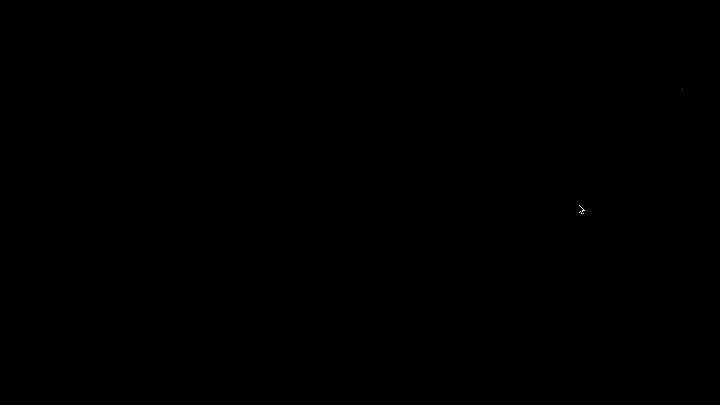

Over the week, I have found a interesting processing library created by Thomas Diewald -- pixelFlow. It is a library for high performance GPU-computing(GLSL), gives developers more direct control of graphics without having to use hardware specific languages. One of its example —bloomDebug showcased a glowing effect on shapes.  

I think the graphic output might look good if apply this effect on my particle system, it eventually make the graphic looks dreamy, which meet the objective of Utopia — alleviate anxious feelings.  

