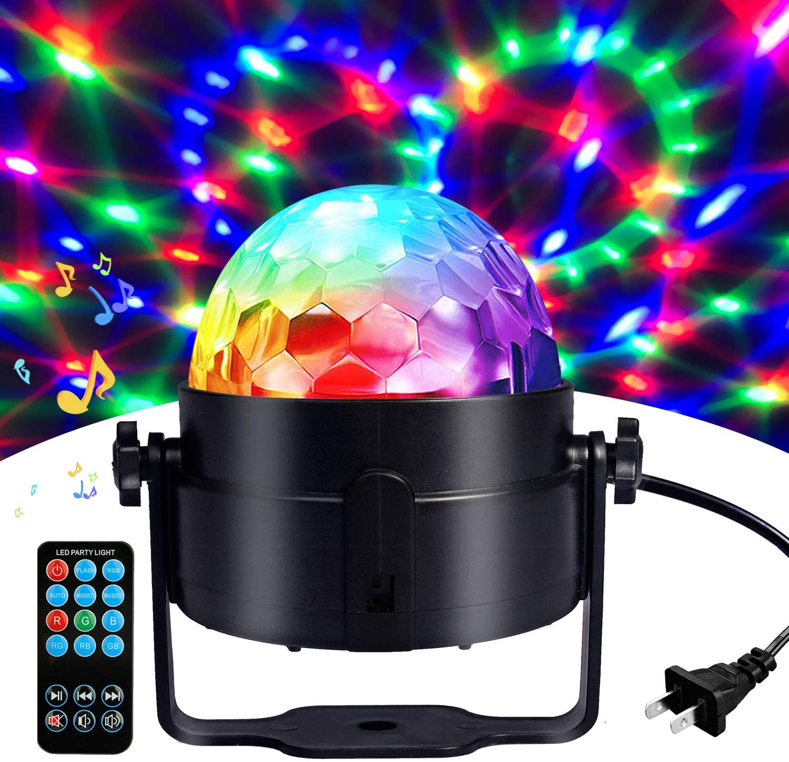

It has come to the final week of the semester and I am so glad to see everyone’s [hardwork](https://karenanndonnachie.github.io/Slave-To-The-Algorithm/Slave_ribbon/). Coming to the end of my project, I decided to set up an installation at home and see how it goes. I did it near sunset time which provides a slightly darker environment for clearer projection, I was afraid that graphics might look blurry but it looks quite clear when I projected it on the wall.  

However, I found that the colour and vibe of the installation somehow reminds me of [disco light](https://www.amazon.com.au/Karaoke-Machine-Portable-Activated-Festival/dp/B01JO7AEK0/ref=sr_1_17?dchild=1&keywords=disco+light&qid=1603286523&sr=8-17) lmao. Maybe that’s where I get my inspiration from hahaha.  

Back to business, while I was setting up the installation at home, I have also tried different sizes and colours of the graphics. 

Virus: 

Green: 

Since Utopia is an indoor interactive installation, in order to show a clearer idea of the installation, I have made a demonstration video on how the installation works. 

I believe interactive installation is more realistic and easier to integrate into life, which is also the objective of my idea— explores the relationship between normal social life and isolation experience.

**Reflection** 
My visit to the Borderless World by teamLab early this year has sparked my interests in generative design. I was so excited during the visit, the ambient light was very dim, creating an atmosphere of mystery. The dynamic graphics are projected on the screen and make me feel so connected to the story they are trying to convey in the midst of automation and algorithmic living. The excitement was in my mind and when I saw Slave to the algorithm in the studio gallery, I knew I was going to take this studio. 

Generative art is a field that I am new to but I am glad that I have stepped out of my comfort zone.
I would not see my potential if I hesitate to try and it would be a waste of opportunity in such a  supportive studio environment. Generative design has exposed me to many possibilities of design, which made me feel the variety approaches of design. Through an introduction to simple software and coding workshop, I started to have a deeper understanding of the algorithm of a generative system, helped me to develop my confidence in completing my project later. I think that generative design is influential and inspirational in life, the practices also explored many ways it can be applied on a daily basis. 

We have developed so much in this studio, from sharing artists and artworks in professional field, tremendous research at the beginning, to creative coding and lastly a complete design system. I have learnt so many about generative and parametric design, skills in p5js and processing. I am really thankful when the initial idea is developed step by step and getting closer towards my expected goal. I want to thank Karen and Andy for this wonderful studio, I really appreciate your patient and the extra time that both of you have spent outside of our scheduled class on Friday. 
