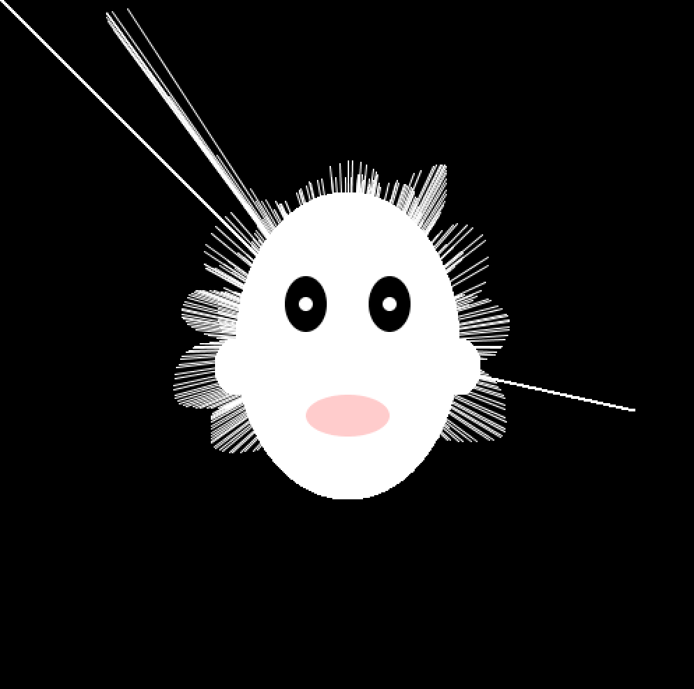
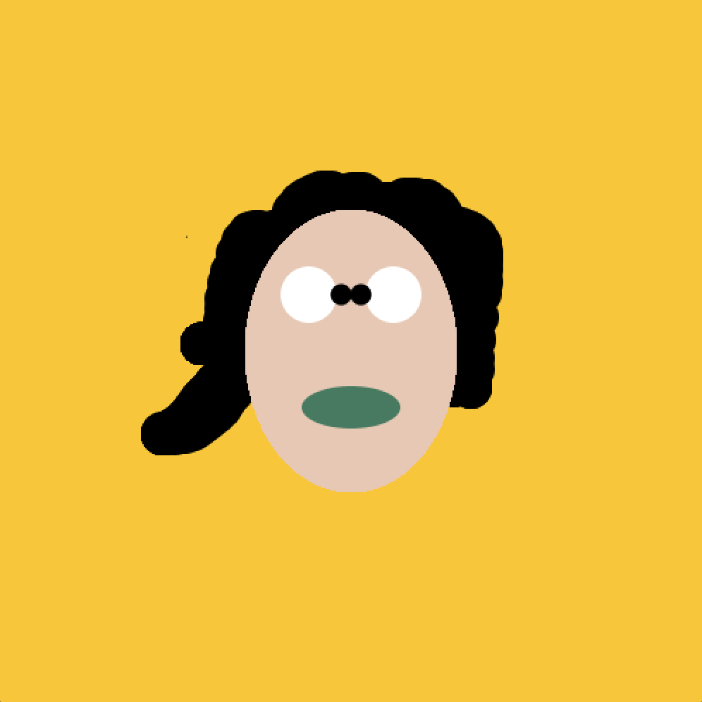

# WK 2 thoughts and observations

**Useful links: **
www.processing.org/exhibition  
www.openprocessing.org

**Generative Artists/artworks: **
Nam June Paik 
Manfred Mohr 
Samuel Monier 
Lean Pierre Hobort 
Angelo Plessas | shismadeoftruth.com 
Raven Kwok | artificial live, reminds you a little of fractal stuffs.

We had our first coding workshop this week and I was very excited to learn and experiment new skills in a field that I have not tried before. It was definitely a good experience for me and I have a better understanding of how processing works.

We started the experiment with just a simple line of code by setting up a canvas and 2D primitives  , and after we got familiar with the functions, I created my first Processing design with the following simple codes. 

void setup(){ 
size (500,500); //this is the size of the canvas 
background (0); //this chooses our background colour 
}

void draw(){//portrait
  ellipse (250,250,160,220);
  fill (0);
  ellipse (220,220,30,40);
  fill(0);
  ellipse (280,220,30,40);
  fill(255);
  ellipse (220,220,10,10);//eyeball
  fill(255);
  ellipse (280,220,10,10);//eyeball
  fill(255,204,204);
  ellipse (250,300,60,30);//mouth
  fill(255,255,255);
  ellipse (170,265,30,40);//ear
  fill(255,255,255);
  ellipse (330,265,30,40);//ear
   

stroke(255); //this choose black as the outline
line (mouseX, mouseY, 250, 250); 
fill (255,255,255);
noStroke(); //turns stroke off
}

void keyPressed(){
background (mouseY/2, (mouseY+mouseX)/4,250-mouseX/2);
}

**Remix**

I remixed Cornor’s artwork. I used mouseX and mouseY function to make the design interactive, and added mousePressed function. So user can draw the hair of the character and erase it when they are not satisfy. 

void setup(){
background(247,198,59);
size (500, 500);
}

void draw(){
if (mousePressed){
fill (247,198,59);
noStroke();
ellipse (mouseX, mouseY, 30, 30);
}
else {
fill(0);
noStroke();
ellipse (mouseX, mouseY, 30, 30);
}

fill(230,200,180);
//the face follows from here
translate(250,250); 
//face
ellipse (0, 0, 150,200); 

//mouth
fill(mouseX/2, mouseY/2, (mouseX + mouseY)/4);
ellipse (0, 40, 70,30); 
noStroke();

//eyes
fill(255);
ellipse (30, -40, 40,40);
ellipse (-30, -40, 40,40);
fill (0);
ellipse (0-mouseX/20, -40, 15,15);
ellipse (mouseX/20, -40, 15,15);
}

