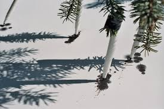
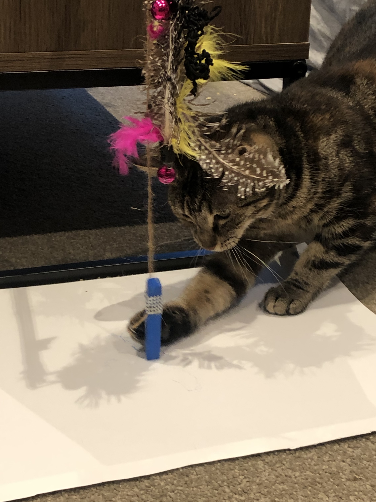
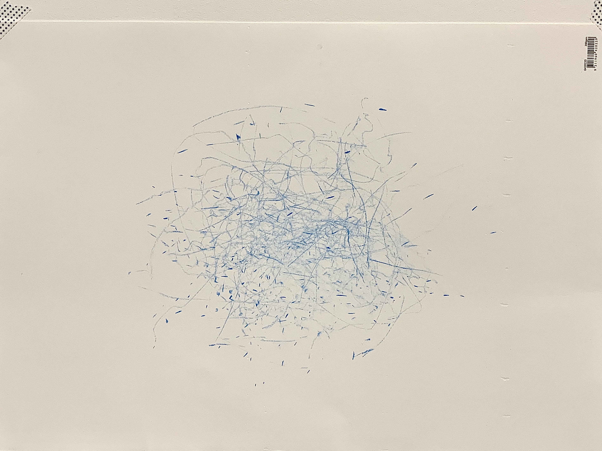

# WK 3 thoughts and observations

**Artists sharing in class:** 
https://www.smithsonianmag.com/arts-culture/5-12-examples-of-experimental-music-notation-92223646/ 
http://www.gregkucera.com/livingston.htm

Tim Knowles | Tree drawings, immerse ourselves in bigger things that we can’t control  
Joseph Griffiths | drawing machine  
Robert Howsare | drawing apparatus 
David Shingler | Bird drawing machine, 2008 
Joseph DeLappe 
From all the artists shared by Karen, I really loved the tree drawing piece by Tim Knowles. Tree drawings are produced using simple drawing tools attached to the tips of tree branches. In collaboration with the wind and local weather conditions, then gestures and automatic drawing are recorded on paper. 

**Machine Drawing** 
We had a fun activity this week, using materials we have in our home to make a drawing machine. I simply tied the oil pastel to the cat teaser and let my cat draw it, recorded the movements of her playing her toy. She was very curious at first but she lost her interest after a while. The result is quite random but surprising, the drawing is composed by curves and spots. 

**Project pitch direction**  
Through the readings and research I’ve done, I am very interested in generative design that’s interactive and animation design that changes with the variable parameters. 
