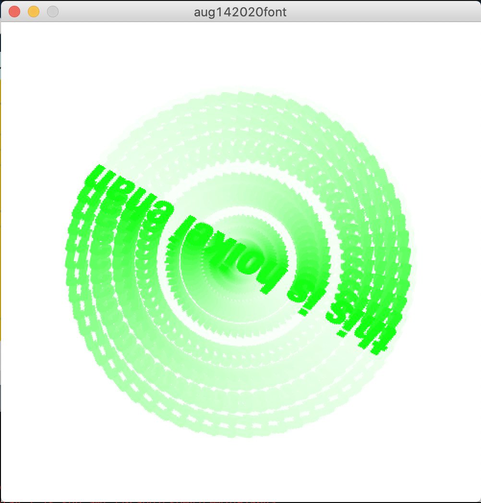
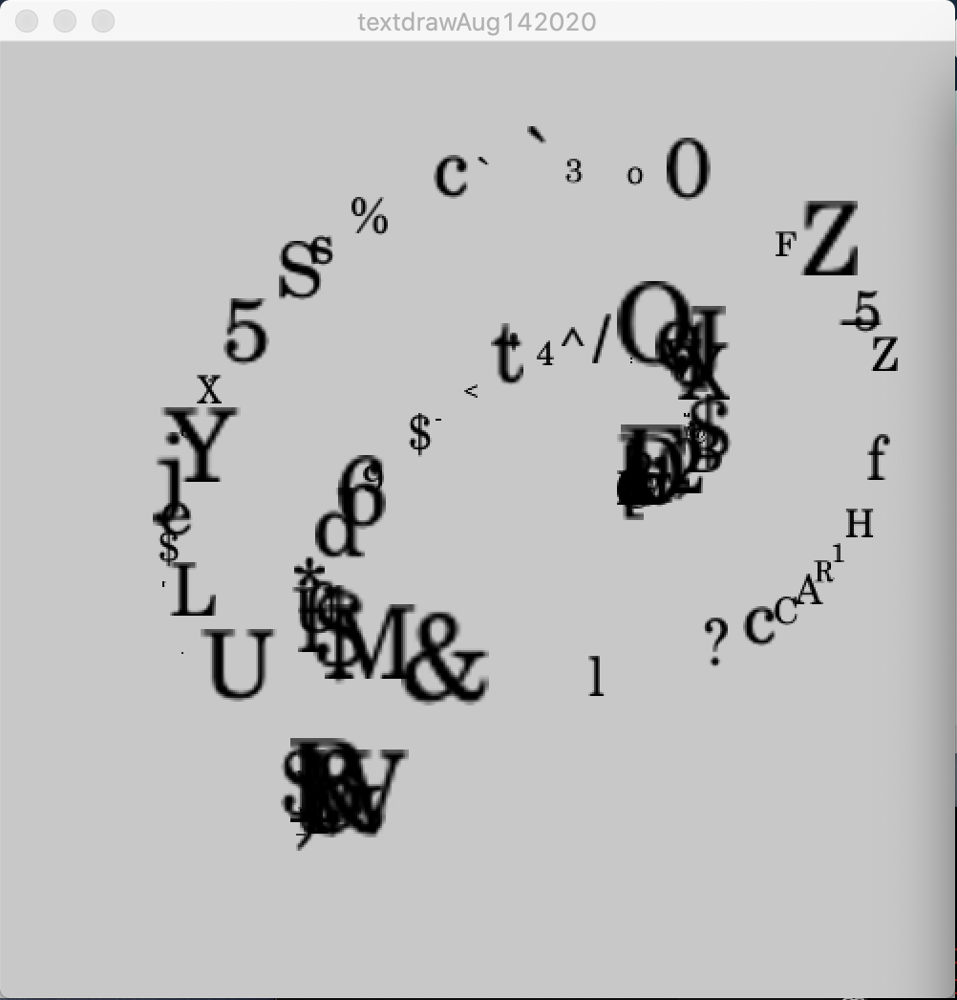
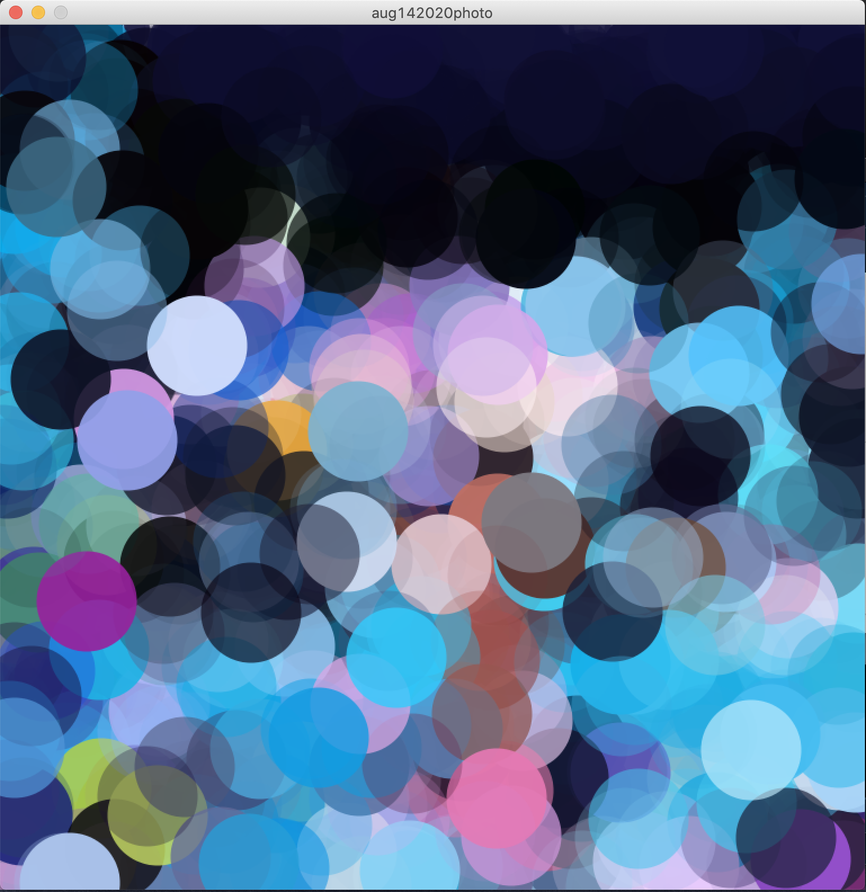
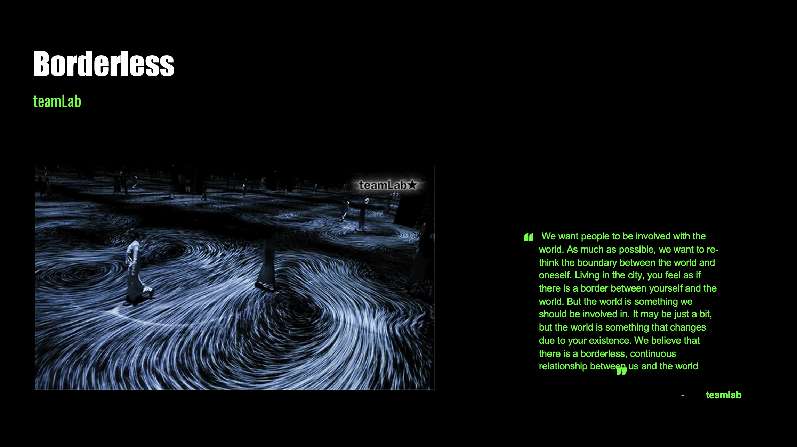
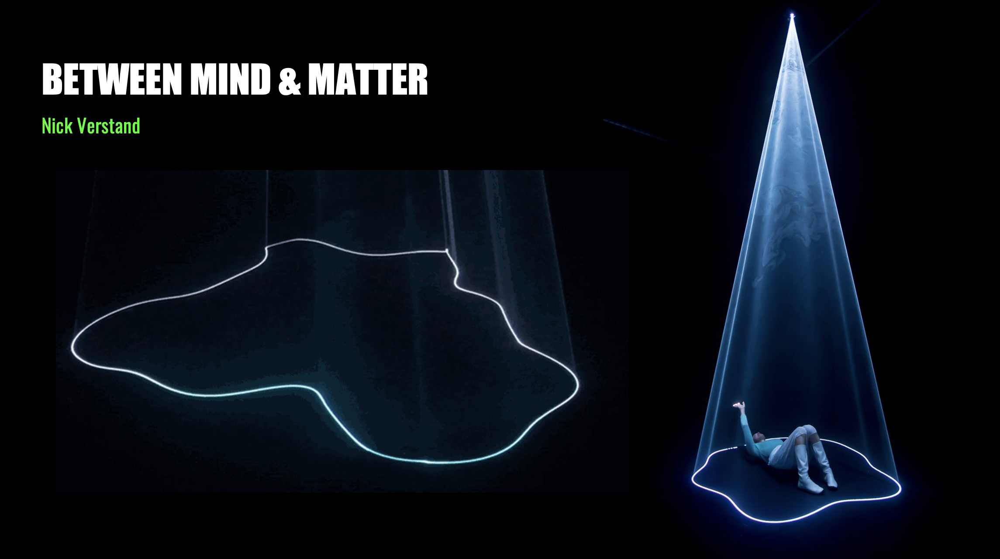

# Coding Session

We’ve started today’s session with coding integrating texts, images and interactive elements in processing. We had experimented sketch by importing a webcam to the processing canvas and it was fun, and we can even choose different typefaces of display texts. 

**Spinning fonts**
```javascript
PFont helvNeue,bookMan, helv;
float spin=0;

void setup(){
  size(500,500);
  background(255); 
  fill(0);
  smooth(4);
  //helv = createFont("Helvetica", 32, true);
  helvNeue=loadFont("HelveticaNeueLTStd-HvCnO-48.vlw");
  //bookMan=loadFont("BookmanOldStyle-Bold-24.vlw");
  
  textAlign(CENTER,CENTER);//horozontal align, vertival align
  
  frameRate(30);//sets the animation speed (frames per second)
}

void draw(){
  fill(0,255,0);
  translate(width/2,height/2);
  spin+=.1; //increments the rotation value
  
  rotate(spin);
  
  textFont(helvNeue);
  textSize(48);
  text("this is hoikei chan", 0, 0);
  
  fill(255,20);
  noStroke();
  rect(-width/2,-height/2,width,height);//
  //textSize(18);
  //textFont(bookMan);
  //text("Bookmanoldstyle 24pt", width/2, height/3);
}

void keyPressed(){
  background(255); //clears the background
}
```



**Draw with texts**

```javascript
PFont myfont; //initiating 
int randchar,randSize; //initiating our variables
char letter;
color randColorR,randColorG,randColorB;
void setup(){
  size (500,500);
  background(200);
  myfont = loadFont("CenturySchoolbook-24.vlw");//font needs to be in your data folder(use the "create font")
  
}

void draw(){
  fill(0);
  textFont(myfont);
  randchar=int(random(120)+1);//this will pluck a random character out of our 'type'
  randSize=int(random(60)+1);
  letter=char(randchar);
  textSize(int(randSize)+1);
  
  if (mousePressed){
    text(letter,mouseX,mouseY);    
  }
}

void keyPressed(){
  randColorR=int(map(mouseX,0,width,0,255));
  randColorG=int(map(mouseY,0,height,0,255));
  randColorB=int(map(mouseX+mouseY,0,width+height,0,255));
 background(randColorR,randColorG,randColorB); 
}
```



**Import photo**

```javascript
PImage photo; //there will be a varaiable that we call it photo 
int smallPoint, largePoint, x, y, dotSize, t; //int means numbers
color pix;
float pointillise;

void setup(){
  size(768,768);
  background (255);
  imageMode(CENTER); //imagemode specific to photo function, default is top left 
  photo = loadImage("teamlab.jpg"); //variable name must be the same as the PImage
  smallPoint = 4;
  largePoint = 90;
}

void draw(){
//image (photo,384,384); //coordinates at the back is located at the center, this loads the image to fil the sketch

x=int (random(photo.width)); //finds the random point across the sketch (x)
y=int(random(photo.height));

pointillise = map(mouseX, 0, photo.width, smallPoint, largePoint);//map(input, lowest value in, highest value in, lowest value out, highest value out)
dotSize = int(pointillise);

pix=photo.get(x,y); //gets the color value from the random point on the image 
t=int(random(256));//transparency of the circle 

fill (pix,t); //updates the color of the fill() to the pixel values as set by color
//strokeWeight(3);
//stroke (pix,t);
noStroke(); //removes the outline of the circle 
//ellipse(384,384,50,50); //(circle location,circle size) 
ellipse(x, y, dotSize,dotSize); //this draws the circle with the color values
//line(x,y,x+dotSize, y+dotSize); //this draws the lines 
}
```



# Researches 

I did some brainstorming and researches regarding the topic I chose. The whole idea came from the stage 4 lockdown in Melbourne, people might experience a wide range of thoughts and feeling disconnected from others. Changes to the usual ways of life can make people feel anxious, severing social support as part of an imposed quarantine or isolation strategy can threaten an individual's sense of connectedness. This makes me question myself if there’s a way to alleviate the anxious feelings during isolation/stage 4 lockdown. So I started my project with researches that also explore relationships. 

**Teamlab**<br/>
Borderless is an art experience created by groups of creatives from different industrial fields. The space holds a collection of eight distinct installations which pushes the boundaries of immersive art. The installations aim to examine the way we experience art, attempting to dissolve the invisible boundaries between the two in a metaphorical reference to our perception of borders between various elements we encounter as humans in our lifetime.

The artwork is created by a computer program that continuously renders the work in real time. The interaction between people and the installation causes continuous change in the artwork: previous visual states can never be replicated, and will never reoccur. 



**Between Mind & Matter**<br/>
Similar to the Borderless, Nick Verstand created installation that explores the subtle and diffuse transition space between physical and perceived reality. The exhibition creates an audiovisual environment, engaging with visitors during extended interactions and enhances their human experience. Visitors were equipped with multiple biosensors that register brainwaves, heart-rate variability. Then the emotional data was analysed and metamorphosed into different forms, colours and intensities of light that were beamed onto them from above. 

Both case studies falls under the community of immersive art or interactive art specifically, immersive art enables everyone to feel much included. It constitutes a dialogue between the artwork and the participant, to enhance the experience of the installation. And these researches actually inspired me on how I can execute my idea through interactive art. 



**Utopia**<br/>
The idea was to track data of anything that can move, for instance birds flying, wind’s effect on tree, or even pedestrians passing by. The motion data will then process through the design system and generate artwork according to the movements. Alternatively , capture my own body movements or heartbeat and project myself outdoor, creates an illusion of getting back to normal social life, where we can hangout with friends and families like we used to do. The dynamic artwork can be projected indoor on the wall, creates a vibrant, interactive post lockdown world -- Utopia. 


