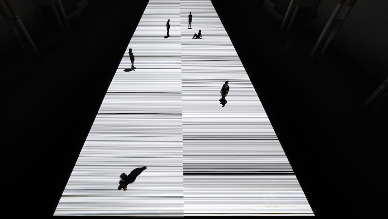

It’s presentation today and I was very excited to see other’s concepts, its more like a sharing session where we can learn so much from others. After the presentation session, I found some interesting research and case studies that might be helpful to my projects. 

**Ryoji Ikeda | Test Pattern**<br/>
Test pattern is a system that converts any type of data (text, sounds, photos and movies) into barcode patterns and binary patterns of 0s and 1s. Through its application, the project aims to examine the relationship between critical points of device performance and the threshold of human perception.



**Coding Session | webcam**
``` javascript
//sketch to use webcam or connect to video device 
import processing.video.*;

Capture webcam;

void setup(){
size (640,480);
webcam = new Capture(this, 640,480);
webcam.start();
}

void draw(){
  if(webcam.available() == true){
webcam.read();//start picking up information from the webcam
  }
image (webcam,0,0);
color pix = (webcam.get(mouseX, mouseY));
fill(pix);
noStroke();
ellipse(mouseX, mouseY, 50,50);
}
```
