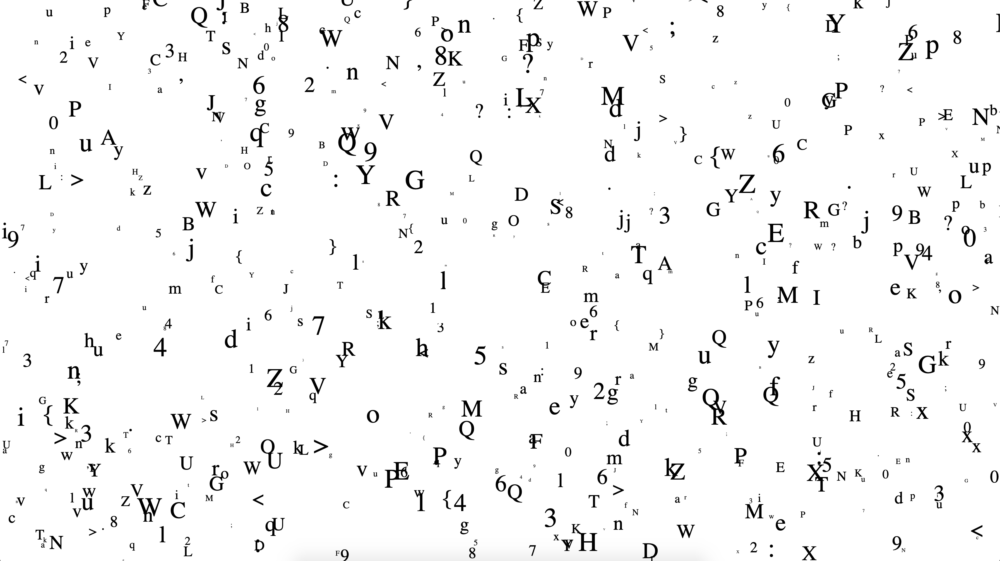
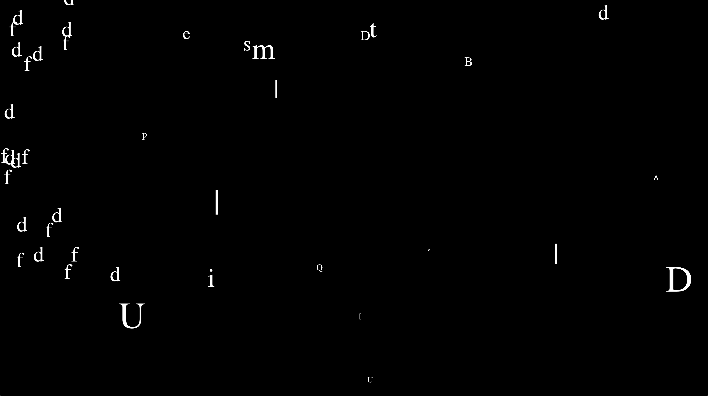

**One Minute Presentation**<br/>
I will stick to my previous idea, basically to generate artworks that helps to alleviate the anxious feelings during the lockdowns. During the week, I did some coding regarding the graphic outcomes and im still working on it. The biggest challenge for my project is to collect raw data successfully via kinetic sensor, it works easier on windows system but I don’t have one currently. 

**PseudoCode**


**Coding Workshop | Random Letters**<br/>
```javascript
const letters= 'abcdefghijklmnopqrstuvwxyz0123456789ABCDEFGHIJKLMNOPQRSTUVWXYZ{};:<>,.?/';
var rand, listLength;
function setup() {
 createCanvas (windowWidth, windowHeight);
 background(255);
 textSize(24);
 noStroke();
 textFont("Times");
 //frameRate(5);
 listLength=letters.length;
}


function draw() {
 rand = int(random(0, listLength-1));
 fill(0);
 textSize(random(5,50));
 text(letters[rand], random(width), random(height));
 //background(255,1);
 fill (255);
 ellipse(mouseX, mouseY, 150,150);
}
```


**Coding Workshop | Wiggly Letters and Classes**<br/>
``` javascript
var letter, size, rand, speed, xposition;
var wigglyLetters = []; //[] means long array lists 

function setup() {
  createCanvas(windowWidth, windowHeight);
  background(0);
  textSize (32);
  textFont ("Times");
  xposition = 0;
  yposition = 50;
}


function draw() {
  fill(255); 
  background (0);
  for (var i = 0; i < wigglyLetters.length; i++) {//for each of the wiggly letters that we have 
    wigglyLetters[i].wiggle(); //generate a new x y position 
    wigglyLetters[i].display();
  }        
}

function mousePressed(){
  rand = int(random (65,160));
  letter = char (rand);
  size = int(random (6, 100));
  speed = int(100 - size)/4;  //slower speed
  //speed = 100 - size; //faster speed
  wigglyLetters.push(new Wiggle (mouseX, mouseY, size, letter, speed));
}

function keyTyped() { 
  wigglyLetters.push(new Wiggle (xposition, yposition, 54, key, 2));
  xposition += 54; 
}

function keyPressed(){
  if (keyCode === LEFT_ARROW){
    wigglyLetters = [];
    xposition = 0;
    yposition = 50;
  }
  else if (keyCode === RIGHT_ARROW){
    yposition += 60;
    xposition = 0;
  }
}

class Wiggle { 
  constructor (x, y, size, letter, speed){  //allow new members
    this.x = x;
    this.y = y;
    this.textSize = size;
    this.letter = letter;
    this.speed = speed; //for each wiggle we had, it has its own property 
  } 
  wiggle() { //random walker
  // x+=1 add 1 to the variable
    this.x += random (-this.speed, this.speed);
    this.y += random (-this.speed, this.speed);
    if (this.x <0){
      this.x += this.speed;
    }
  }
  display(){
    textSize(this.textSize);
    text(this.letter, this.x, this.y);
  }
}
```

