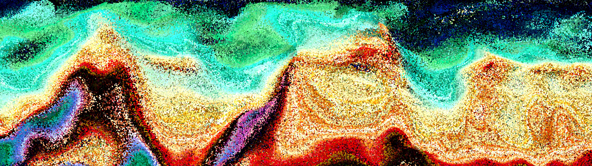
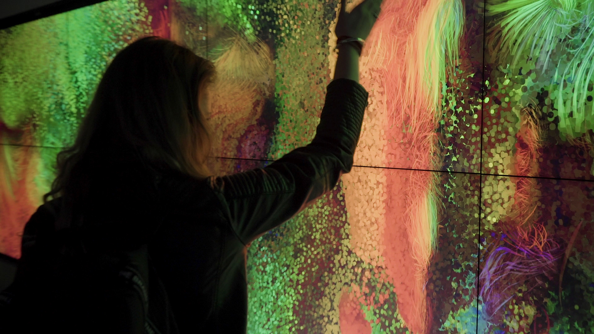

Over the week, I started more research on kinect sensor and figured out how it works. The Kinect sensor has an infrared projector which sends out infrared light into the environment, the sensor camera will read the distance of lights and calculate the depth of that pixels. However, I don’t have a Kinect sensor with me, so I have been brainstorming and exploring all the methods to achieve my idea other than using Kinect sensor. I have looked blob detection and motion tracking libraries in p5js, Karen had also given me a lot of useful resources and links for me to look at. 

Both blob detection and motion tracking works like Kinect sensor. [Blob](https://en.wikipedia.org/wiki/Blob_detection) looks at every single pixel and detect certain colours of the image, and find its colour distance from every pixel and hold the position of the colour. The algorithm of colour tracking in [tracking.js](https://trackingjs.com) works the same as blob detection, both libraries only able to track one colour. Since Kinect sensor works as an individual sensor, it does not limit interactive zone/space like webcam or laptop do. I still decided to use Kinect sensor instead even though p5js supports more libraries(or easier to approach) in generative design. 

I accidentally came across this beautiful interactive installation [E-brush](https://www.behance.net/gallery/79341981/E-Brush), E-Brush is a collaborative artwork generator which represents electric energy. It was developed for Nissan, for their Formula E devision. Through passive and direct human interaction the wall comes to life. The idea is our body is a brush and we can leave a digital mark with our body.

When I looked closer to the image, I can actually see that the image is actually formed by variety of small circles, which inspired me on how I can explore the aesthetic of my project output. 

