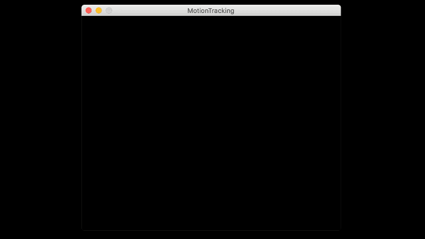
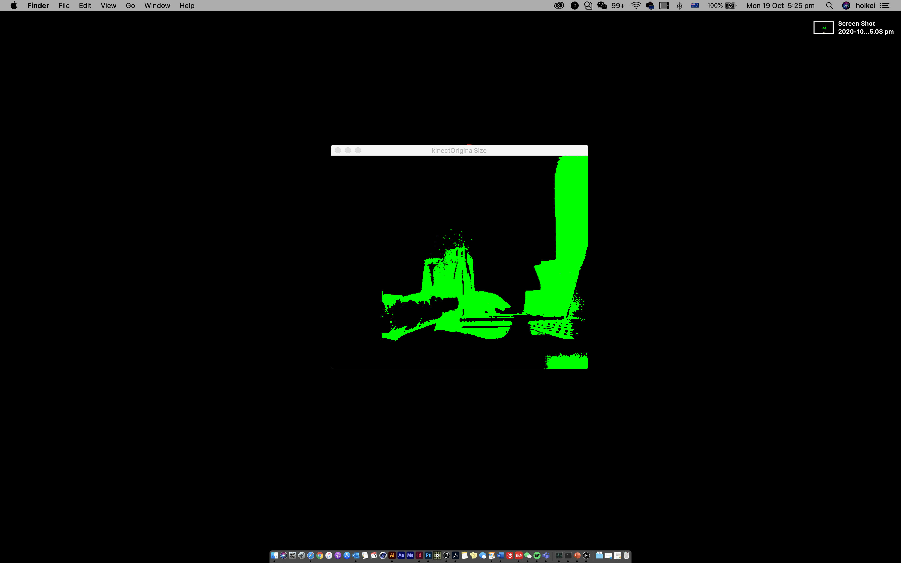

***MILESTONE*** 
In order to achieve the best outcome, I decided to use kinetic sensor instead of web cam. [Danial Shiffman](https://shiffman.net/p5/kinect/)is such a talented programmer, he introduced a Kinect library for processing and by following these steps, I am able to connect the kinetic sensor to my laptop successfully. 

Instead of using the total pixels of the entire image, I calculated the average pixels of the depth data. So that I can find the centre of the moving object and make sure the artworks generated are able to follow the object movements correspondingly. The code works well when there’s only one object detected. 
 

However, if there’s more than one object detected, the circle will be wiggling and jumping around the canvas. Because I am only tracking the average points of every pixels collected, so if there’s more than one object detected, the circle will appear somewhere between different objects. 
 

Besides that, the depth image I’m getting from kinetic v2 sensor has a width of 512 and height of 424, which I didn’t expect the size to be this small. 
Kinect image output size vs my laptop screen size:

